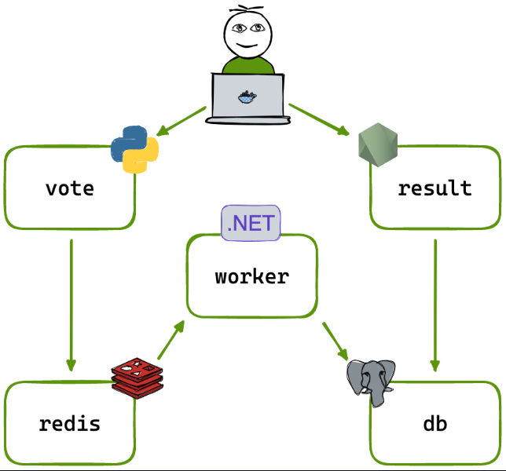
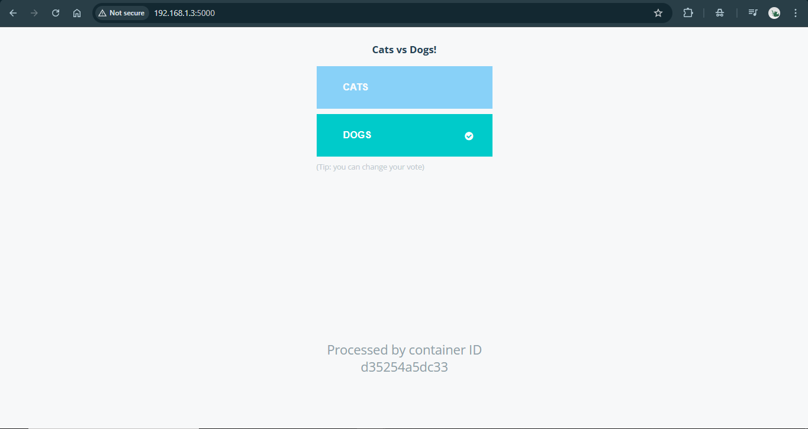
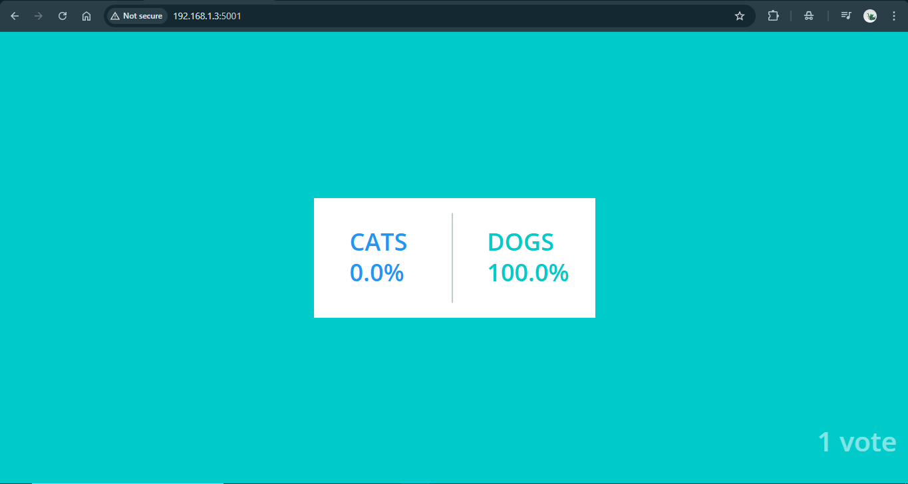

# Docker-voting-app
This application demonstrates a simple distributed system with multiple services communicating through Docker links


# 🚀 Docker Multi-Container Setup using --link
🏗️ Architecture Overview
For this project, I used the dockersamples/example-voting-app repository as the base.

This application demonstrates a simple distributed system with multiple services communicating through Docker links:



🗳️ Voting App (Python) – lets users vote between two options
💾 Redis – collects new votes
⚙️ Worker (.NET) – consumes votes and stores them in a database
🐘 Postgres – database that stores votes, backed by a Docker volume
📊 Result App (Node.js) – displays voting results in real time

# 🧩 Manual Setup using --link
Here, I deployed each container manually and linked them using Docker’s legacy --link feature to understand inter-container communication before switching to docker-compose.

# 1️⃣ Clone the repository
```shell
git clone https://github.com/gowtham-n1/Docker-voting-app.git/
```
```shell
cd Docker-voting-app/
```

# 2️⃣ Start Redis
```shell
docker run -d --name=redis redis/
```

# 3️⃣ Build and run the Voting App
```shell
cd vote/
```

```shell
docker build -t voting-app ./
```

```shell
docker run -d -p 5000:80 --link redis:redis voting-app/
```

# 4️⃣ Start Postgres
```shell
docker run -d -e POSTGRES_PASSWORD=postgres --name=db postgres:9.4/
```

# 5️⃣ Build and run the Worker
```shell
cd ../worker/
```

```shell
docker build -t worker ./
```

```shell
docker run --link redis:redis --link db:db worker/
```

# 6️⃣ Build and run the Result App
```shell
cd ../result/
```

```shell
docker build -t result-app ./
```

```shell
docker run -d -p 5001:80 --link db:db result-app/
```

# ✅ Results
Voting Interface (Python Flask app):
 Accessible on http://localhost:5000

 

Result Interface (Node.js app):
 Accessible on http://localhost:5001

 

💡 Next Step
Now that all containers are linked and communicating successfully, the next phase will be container orchestration using Docker Compose — making the setup easier and more scalable.

🔗 Repository
👉 GitHub: gowtham-n1/Docker-voting-app
